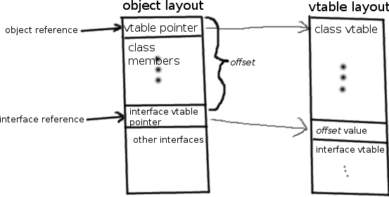
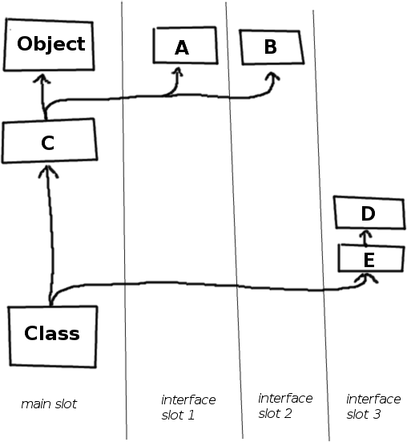

why single-inheritance multiple-interfaces oop is the most beautiful thing
## single-inheritance multiple-interface oop is beautiful

C++'s class system is widely held to be somewhat overengineered, what with the multiple
class inheritance support, protection attributes, diamond pattern, yadda yadda.
But how much improvement does adopting a single-inheritance multiple-interfaces model such as
Java and C# (and Neat) actually give us? In this page, I'll try to explain why using this model
in combination with [Liskov's Substitution Principle](http://en.wikipedia.org/wiki/Liskov_substitution_principle) (LSP)
gives rise to a completely unambiguous classinfo/vtable/class layout design that could, in fact, not possibly look any other way.

A quick note: Classes in Neat (and D) are always references. I will assume this for the rest of the text,
and completely ignore any issues related to objects being mutilated value-types in C++.

tl;dr: "object" means "object reference". Moving on ..

## LSP

Let me summarize the idea behind the LSP first.

Liskov's Principle says, in summary, that class inheritance is a strong "is-a" relationship;
ie. any object of a subclass also is-an object of the parent class. `Apple : Fruit` - any apple
is-a fruit.

Note the difference between `is-a` and `converts-to-using-elaborate-transformation-rules`.
We will interpret the LSP in the strongest form we can - any object of a subclass _is also immediately_
an object of all superclasses. Assuming all classes inherit from an Object class that forms
the root of the object hierarchy, this immediately means that our vtable pointer has to be somewhere in
Object. It can't be, say, at the end of the class since then adding new members would move the vtable
pointer around and break the LSP.

Conversely, **[rule LSP] anything we add to a superclass in the creation of a subclass must appear "beneath" all the data that describes the
superclass**.

Read that again, it's important. The strong LSP says we cannot mess with, or shift around,
any data that "belongs to" the superclass. That goes for object data but also for vtable data,
no matter whether it's stored inside the object or in a separate classinfo structure that the object points to.
You can do it either way, of course, but I'd strongly recommend using a separate classinfo structure, since it's pointless
to blow up every object by half a dozen pointers that are gonna be the same for most objects anyway.
In any case, the design constraints are the same; however, **for the rest of this document, I will assume that you
put the vtable in a separate structure and merely include a pointer to it** (since that's what Neat does).

Since we're using bold for guiding principles, let's introduce a second one:
**[rule no-fat-pointers]: no class or interface reference should be larger than one pointer**. No futzing with fat pointers, that just complicates everything.
As we'll see, it's not necessary anyway.

And while we're at it, the third rule:
**[rule no-stubs]: no stub functions, no multiple "versions" of a single function**. They're ugly, and we're going for beautiful.

## Let's leave out interfaces for now.

Given that, we're basically done. We just put our new members "underneath" the superclass's members and our new functions "undearneath"
the old class's functions in the vtable, meaning that any object of a class starts with a smaller object of the superclass, which starts with
etc all the way up to the root of the hierarchy.

## Now interfaces!

How much does adding interfaces to this model complicate it? The answer is: somewhat, but not very.

Interfaces are a series of functions that an object must implement. What does an interface reference need to contain?
It needs to contain some way to get at a function pointer for each interface function that can be called on it, and it
needs some way to get an object reference to call them with. And all that within one pointer, due to rule "no-fat-pointers".

A brief sidenote: the only sane thing to do is to call interface functions with the **object reference**, not the **interface reference**.
Why? Interfaces are always implemented in objects; thus, one function may be required to satisfy both interface requirements
and superclass requirements. Since that function _needs_ to take an object reference to correctly satisfy the superclass requirement,
calling it with interface references in the interface would require generating a stub function to convert interface reference
to object reference, violating the "no-stubs" rule. So: any function call, class or interface, will always take an object reference.

To extend the strong LSP to interfaces, we will also require that **all interface references
_are-a_ reference to their first parent interface**, just like objects _are-a_ reference to their superclass. This will
help us minimize wasted space later.

To fulfill these constraints, we need some way to get from an interface reference to the object reference
( **Strong LSP**: all object references to the same object are the same pointer).
This is how we achieve this: when inheriting a class from an interface, we

* put the interface's vtable after the class's vtable
* put a pointer to the interface's vtable at the start of our own data
* the interface's vtable begins with an integer we'll call _offset_, which is the offset between that pointer and the start of the object
* an interface reference is a pointer to the interface vtable pointer in the object (see point 2).
* to call an interface function, use the interface vtable pointer to find the function,
then subtract the _offset_ from the interface reference to get the class reference to call the interface function with.

Got that?

No, but that's okay. I got a diagram.

Note that the interface can only add functions, not data; so the interface vtable pointer in the class will always be just a pointer
into the vtable. We will call this pointer an "interface slot". 

Since we're trying to minimize wasted space, we want to keep the number of required interface slots as low as possible.
This is where the interface version of the LSP comes in: we only need to add a slot for each _additional_ parent interface.

Example. Consider the following hierarchy:

    interface A { }
    interface B { }
    class C : A, B { }
    interface D { }
    interface E : D { }
    class Class : C, E { }

Despite the fact that we have four parent interfaces and one parent class to Class, we can get away with a mere three interface slots,
since E is-a D. Note that C is-**not**-an A in the strict sense, since the primary parent of C is _Object_, not A. Regardless,
converting a C to an A is easy, since thanks to strong LSP, any subclass of C will start with the same layout as C, and its vtable will
start with C's vtable, so that the _offset_ of A's interface slot in C is known, regardless of the _actual_ class type of a given C reference.

Another diagram!

So the complete class layout of Class is:

* Object's member data
* C's interface slot 1
* C's interface slot 2
* C's member data
* Class's interface slot 3
* Class's member data

And the vtable layout is

* Object's functions
* C's functions
* C's slot offset 1
* C's interface functions 1
* C's slot offset 2
* C's interface functions 2
* Class's functions
* Class's slot offset 3
* Class's interface functions 3

So in summary, the **no-stubs** and **no-fat-pointers** rules force us to call interface functions with object references,
necessitating the _offset_ member in the vtable, the **strong LSP** forces us to put our class data, interface vtables and slots _after_
our parent's classinfo and class data, and conservation of space forces us to move the vtable into a separate space, as well as
the unambiguous slot layout.

No aspect of this design is arbitrary.

And that's why it's the best thing ever.